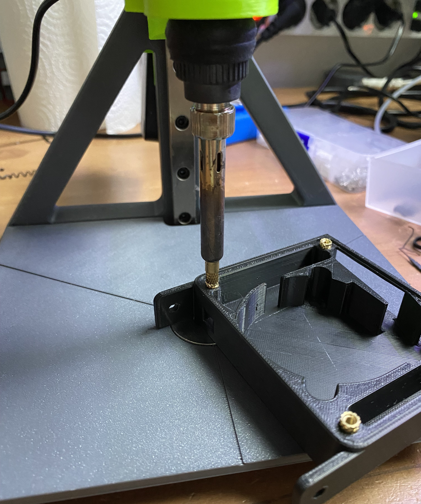

[](https://buymeacoffee.com/makermaking)


# (null)VOC
The carbon filter that fits in your Micron+ without mods!


- [(null)VOC Background](#(null)VOC-Background)
- [BOM](#BOM)
- [Printed Parts BOM](#Printed-Parts-BOM)
- [Printed Parts Considerations](#Printed-Parts-Considerations)
- [Assembly](#Assembly)
- [Installation](#Installation)
- [Klipper configuration](#Klipper-configuration)

## (null)VOC Background

When it came time to choose which mods I was going to use on my Micron+, I realized that the only option at the moment was 3DPF, a very good project, but in my opinion, it could have some improvements and a slightly more "Voron" aesthetic.

**(null)VOC is based on:**
- [The original Nevermore](https://github.com/nevermore3d/Nevermore_Micro) (Lots of good info on carbon filters on this page)
- [3DPF by @Jadecky](https://github.com/nevermore3d/Nevermore_Micro) 
- [The ZeroFilter by @zruncho](https://github.com/zruncho3d/zerofilter)

This is one of the most complex projects I have done to date, and when designing it, I did not have a clear idea from the beginning. Therefore, the design is not very parametric due to poor organization during its creation, leading to numerous fusion errors when making the slightest change. I will try to improve the base file and upload the enhanced version, but this does not affect the final design itself, just in case you want to modify it.

**Some main features of (null)VOC:**
- Designed to fit under the bed of the Micron+ without mods (3DPF does not fit in FORMBOT kits by default)
- Click-on lid
- Magnetically connected cartridge
- JST-XH connection or cable adapter
- Directed airflow
- Reduced hardware and printed parts by 50% when compared to 3DPF

## BOM
Qty |Part|Notes
---|----|---
8x|6x3 Magnets
6x|Voron Spec Brass Heatset Inserts|M3x5Dx4.5W
2x|M3x8 FHCS|M3x6 / M3x10 FHCS will also work for attaching the fan to the plenum
4x|M3x6 BHCS|M3x8 / M3x10 BHCS will also work for the plenum lid
2x|M3x6 BHCS|To mount the plenum to the extrusions
1x|5015 Blower Fan
1x|JST-XH Female|Optional

## Printed Parts BOM
Qty|STL
---|---
1x|Plenum
1x|Cartridge 
1x|Plenum Lid
1x|Cartridge Lid

##Printed Parts Considerations
- You don't need any support for any part.
- You should print the part in the default orientation of the STL.
- You must print the parts in ABS if you dont want to burn all pieces.

## Assembly


- Glue the 8x magnets into the plenum and the cartridge

**ATENTION!**\
Make sure that before gluing the magnets, the poles of the magnets on the cartridge and the plenum match with each other, speaking from experience :(


- Insert 4x heatsets into the Plenum for the lid securing screws.



- Insert 2x heatsets into the bottom of the screw tabs on the 5015 fan.


- You may need to recess them 1-2 mm to allow the screws to sit correctly on the underside of the plenum.

_(Photo from 3DPF)_

- Screw 2x M3x8 BHCS on the bottom of the plenum to attach the fan.


**If you simply want to run the fan cable directly, ignore the following two steps and print the next file, which will allow you to insert the cable and then fit it into the same hole where the JST connector goes.**

- Solder the two fan wires to the JST-XH connector, paying attention to the polarity (Included an image for reference).


- With the connector soldered, insert it into the hole where it should fit tightly (make sure to push it all the way in). Spread hot silicone to keep the connector and its connections in place. You can leave the excess cable in the hole (as shown in the image) or you can cut it directly.


_The hard part is done!_

- Insert the leading edge of the plenum lid into the small gap, and then press the lid down until it is fully inserted.


- Screw 4x M3x6 BHCS to secure the lid into the plenum.

- Slide in the lid into the cartridge.


Congrats! Now it is fully assembled, let's install it!

##Installation
- First, you will need to remove the bed.
- With the bed removed, you can insert one nut into each bed extrusion.
- Now you can pass the cable through the hole and screw in a screw on each side to its respective nut. It's normal for the fins to flex a bit due to the tolerance that may exist between the two extrusions, but don't worry because the flexion is minimal.

- Search "Your motherboard + pinout" on Google and you'll be able to find out which ports are available for connecting fans.

##Klipper configuration
My configuration establishes that when the bed reaches 90°C, the fan will turn on and will turn off as soon as the target temperature is below 90°C. This way, when printing with ABS, which in my setup requires a bed temperature of 105°C, the fan will turn on.
```
[heater_fan nullvoc]
pin: YOUR FAN PIN
heater: heater_bed
heater_temp: 90.0
fan_speed: 1
```


